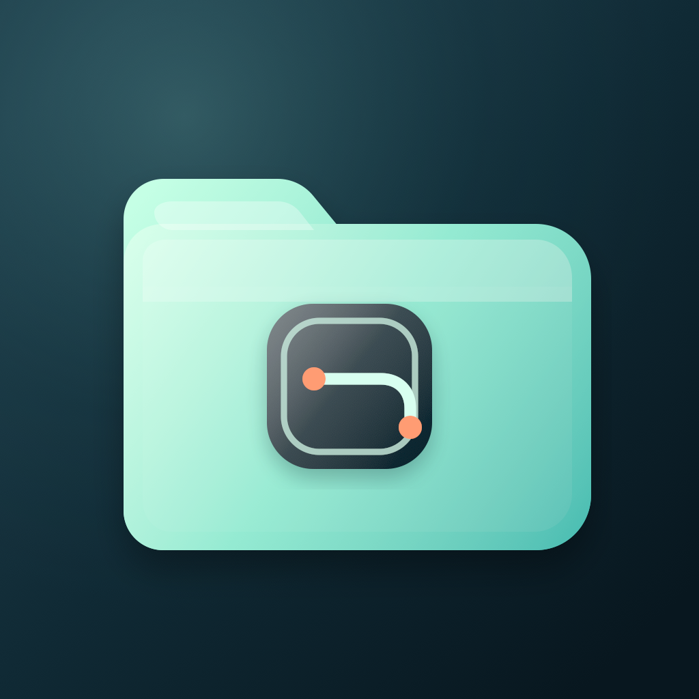

# 资源台（iosRemoteFolder）

<p align="center">
  
</p>

资源台是一款面向 iPhone 与 iPad 的原生资源浏览和查看应用。它将 Files 本地文件夹、WebDAV 与 Alist / OpenList 的 `/dav/` 端点统一到一套浏览、搜索、预览、阅读、播放和内容缓存体验中。

项目使用 Swift 6、SwiftUI、SwiftData 与 Swift Concurrency 构建，最低支持 iOS / iPadOS 17。当前实现不依赖第三方 Swift Package。

## 核心能力

### 统一来源

- 从系统 Files 选择本地文件夹，通过 security-scoped bookmark 持久保存授权，并支持改名、重新选择文件夹和移除来源。
- 添加、编辑 endpoint/凭证、重试和移除 WebDAV 或 Alist / OpenList 来源。
- Alist / OpenList 使用标准 WebDAV `/dav/` 接口，不依赖服务端私有 API。
- 非敏感来源配置保存在 SwiftData；远端用户名和密码保存在 Keychain。
- 来源适配器与查看器解耦，浏览界面不会直接接触 URLSession、凭证或协议细节。

### 浏览与搜索

- Home、Browse、Sources、Offline 四个顶层区域。
- 文件夹下钻、面包屑导航、来源切换和资源类型筛选。
- 使用 SwiftData 为已浏览目录建立增量索引，支持按名称或路径搜索，并可按来源、类型过滤。
- 搜索范围会明确显示为“已浏览目录”，不会把局部索引描述成服务器全量搜索。
- 最近打开记录可单项移除；PDF 页码、文本阅读比例和音视频播放位置按资源版本记录。

### 内容预览

- 图片缩略图与有界下采样。
- PDF 首页预览。
- Markdown 与纯文本摘要。
- 对已确认支持 Range 的媒体生成视频代表帧或读取音频内嵌封面。
- 满足预算的其他文件使用 Quick Look 缩略图。
- 预览请求支持并发上限、超时、取消、内存/磁盘缓存和资源版本失效。

### 阅读与播放

- PDFKit PDF 阅读器。
- Markdown 渲染与源码查看。
- 纯文本阅读器。
- 支持缩放和平移的图片查看器。
- 基于 AVFoundation 的音频和视频播放器，支持进度跳转与继续播放。
- 视频支持沉浸式控制、双击前后跳、亮度/视频音量手势和方向锁定。
- 音频支持后台播放、Now Playing、锁屏和耳机遥控。
- 已知长度且满足物化预算的其他文件可使用 Quick Look、系统分享或“打开方式”。实际可用性取决于 iOS 和设备上已安装的 App。

## 文件类型

资源台综合使用服务端 metadata、MIME、UTType、扩展名和最多 4 KiB 的文件签名识别内容。明确冲突会被保守拦截，避免仅依据错误扩展名或通用 MIME 选择查看器。

| 类别 | 常用扩展名 | 处理方式 |
| --- | --- | --- |
| PDF | `pdf` | PDFKit 原生阅读器 |
| Markdown | `md`, `markdown` | 原生阅读器，支持渲染/源码模式 |
| 文本 | `txt`, `text`, `log` | 原生文本阅读器 |
| 图片 | `png`, `jpg`, `jpeg`, `heic`, `heif`, `gif`, `webp` | ImageIO 解码与 SwiftUI 查看器 |
| 视频 | `mp4`, `mov`, `m4v`, `mkv` | AVFoundation 播放器 |
| 音频 | `mp3`, `m4a`, `aac`, `flac`, `wav` | AVFoundation 播放器 |
| 系统支持的其他格式 | Office、iWork、压缩包等 | Quick Look、分享或“打开方式” |

音视频能否最终解码取决于文件容器、内部 codec 与当前设备的 AVFoundation 支持。扩展名出现在表中不代表任意编码组合都可播放。

## 加载与缓存

加载链路围绕“尽快展示、限制读取、可取消、版本隔离”设计：

- 只连接用户当前选择的来源，不为未选来源提前建立网络请求。
- 已访问目录使用 30 秒快照和 stale-while-revalidate 策略，返回目录时先展示缓存结果，再在后台检查更新。
- 支持 Range 且超过 64 KiB 的文本预览只读取前 64 KiB，并处理 BOM 与多字节字符截断；其他文本路径仍受 256 KiB 总预算约束。
- 内容类型探测最多读取 4 KiB；已存在同版本完整缓存时优先复用缓存前缀。
- 大于 4 MiB 且服务端已证明支持 Range 的在线媒体，通过受控分段读取交给 AVPlayer，避免播放前完整下载。
- 内容与预览缓存键包含来源身份、规范化路径、资源 revision 和内容变体，版本变化后不会复用旧数据。
- Offline 页面展示已经完整写入内容缓存且 revision 已知的资源；它不是显式下载队列。

当前缓存仍以加速再次打开为主。全局容量配额、LRU、单项管理、后台下载和持久离线任务属于后续工程范围。

## 架构

```text
SwiftUI
  -> AppModel / SourcesStore
  -> SourceRegistry
  -> ResourceAccessService
  -> ResourceContentSession
  -> ViewerRegistry / ResourcePreviewPipeline
  -> PDFKit / ImageIO / AVFoundation / Quick Look
```

| 目录 | 职责 |
| --- | --- |
| `iosRemoteFolder/App` | App 入口、组合根、全局状态与四个顶层界面 |
| `iosRemoteFolder/Domain` | 资源身份、路径、metadata、revision 与能力模型 |
| `iosRemoteFolder/Sources` | 本地、HTTP、WebDAV/Alist 适配器及受控内容会话 |
| `iosRemoteFolder/Indexing` | 已浏览目录的 SwiftData 索引与搜索 |
| `iosRemoteFolder/Cache` | 按资源身份、revision 和内容变体组织的持久缓存 |
| `iosRemoteFolder/Viewers` | 类型解析、预览管线、专用查看器与系统文件 fallback |
| `iosRemoteFolder/Playback` | AVPlayer 引擎、Range loader 与媒体预览 lease |
| `iosRemoteFolder/UI` | 资源行、预览、主题和格式化组件 |
| `iosRemoteFolderTests` | Swift Testing 单元与集成测试 |

## 环境要求

- macOS 与 Xcode 26.6，或可编译 Swift 6 / iOS 17 target 的更新版本
- iOS / iPadOS 17.0+
- iPhone 或 iPad Simulator；真机运行需要配置自己的 Development Team
- 可选：用于手工联调的 WebDAV 或 Alist / OpenList 服务

## 运行项目

1. 克隆仓库并打开工程：

   ```bash
   git clone https://github.com/zzf-857/iosRemoteFolder.git
   cd iosRemoteFolder
   open iosRemoteFolder.xcodeproj
   ```

2. 在 Xcode 中选择 `iosRemoteFolder` scheme。
3. 选择 iOS Simulator 直接运行；真机运行前在 Signing & Capabilities 中选择自己的 Development Team。
4. 在“来源”页面添加 Files 本地文件夹，或填写 WebDAV / Alist endpoint。

仓库不包含测试服务器、用户名、密码或可用的远端内容地址。

## 远端来源配置

- WebDAV endpoint 应指向实际根路径；Alist / OpenList 通常使用 `https://example.com/dav/`。
- 带用户名或密码的来源必须使用 HTTPS，应用会拒绝通过明文 HTTP 保存或发送凭证。
- 无凭证 HTTP 可用于用户明确选择的自建服务，但当前工程仍允许较宽的明文网络访问。请仅连接可信网络与可信服务；进一步收紧 ATS 和本地网络授权已列入优化计划。
- endpoint 不接受 URL user-info、query 或 fragment。
- 用户名、密码、Authorization、Cookie 和临时签名 URL 不写入持久化来源/资源记录、日志或缓存 manifest；敏感请求头只存在于受控的瞬时请求引用中。

## 构建与测试

Debug 构建：

```bash
xcodebuild build -quiet \
  -project iosRemoteFolder.xcodeproj \
  -scheme iosRemoteFolder \
  -configuration Debug \
  -destination 'generic/platform=iOS Simulator' \
  SWIFT_TREAT_WARNINGS_AS_ERRORS=YES \
  GCC_TREAT_WARNINGS_AS_ERRORS=YES
```

完整测试：

```bash
xcodebuild test \
  -project iosRemoteFolder.xcodeproj \
  -scheme iosRemoteFolder \
  -destination 'platform=iOS Simulator,name=iPhone 17,OS=26.5' \
  SWIFT_TREAT_WARNINGS_AS_ERRORS=YES \
  GCC_TREAT_WARNINGS_AS_ERRORS=YES
```

Release 静态分析：

```bash
xcodebuild analyze -quiet \
  -project iosRemoteFolder.xcodeproj \
  -scheme iosRemoteFolder \
  -configuration Release \
  -destination 'generic/platform=iOS Simulator' \
  SWIFT_TREAT_WARNINGS_AS_ERRORS=YES \
  GCC_TREAT_WARNINGS_AS_ERRORS=YES
```

截至 2026-08-30，iPhone 17 / iOS 26.5 Simulator 完整套件结果为 **270 passed、1 skipped、0 failed**；Debug/Release warnings-as-errors 构建与 Release Analyze 均通过。跳过项是真实 Alist 端到端测试，在没有提供环境配置时会明确标记为 skipped。

真实 Alist 测试读取以下环境变量，不要把凭证写进源码、scheme 或提交记录：

- `ALIST_ENDPOINT`
- `ALIST_USERNAME`
- `ALIST_PASSWORD`
- `ALIST_MEDIA_PATH`
- `ALIST_MEDIA_KIND`

## 路线图

当前优化重点是文件加载性能、格式适配、安全边界和可观测性。详细任务、验收条件和进度见：

- [Optimization TODO](TODO.md)
- [Optimization Plan](docs/optimization-plan-2026-08-30.md)

主要后续方向包括缓存配额与 LRU、显式离线下载、未知长度文件物化、渐进式 PDF、更多文本编码、媒体 codec 预检、HTTP/局域网来源入口、SMB/SFTP、Privacy Manifest，以及真机弱网/UI/无障碍测试矩阵。

## 贡献

提交改动前请先说明问题、复现条件和目标平台，并为行为变化补充对应测试。网络、缓存和文件格式相关改动需要同时覆盖取消、超时、资源版本变化、超预算和敏感信息边界。

建议在提交前运行完整测试、Debug/Release 构建、Release Analyze 与 `git diff --check`。

## 许可

本仓库当前未附带 `LICENSE`。公开可见不代表授予复制、修改、分发或商业使用许可；如需复用，请先联系仓库所有者。
